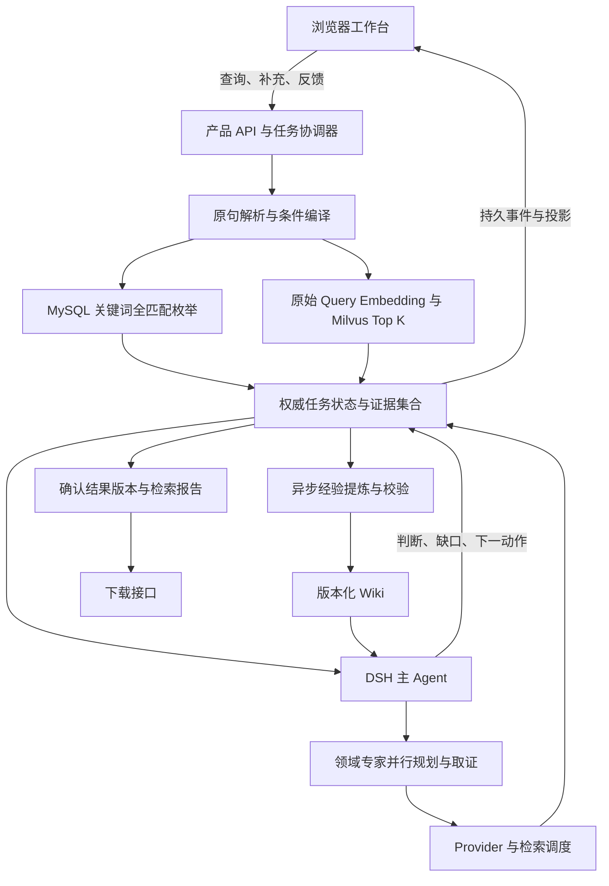

# Retrieval Agent 架构

本文说明系统的数据流、组件职责与状态边界。产品行为以 [产品规格](PRODUCT_REQUIREMENTS.md) 为准，实际包结构见 [生成依赖图](WORKSPACE_GRAPH.md)。

数据库入口将查询计划交给 MySQL 与 Milvus 并行检索，结果进入 MySQL 任务状态，再由 DSH 主 Agent 和领域专家复核。浏览器工作台订阅持久事件，报告与下载绑定同一确认结果版本。Wiki 使用固定版本读取和异步学习发布；检索质量及知识收益需在指定数据与模型下评测。

## 1. 主链与部署形态

采用“持久任务协调器 + DSH 主 Agent/领域专家 + 检索数据面 + 浏览器工作台”。协调器管理可恢复任务和确定性边界，DSH 管模型运行与专家上下文，MySQL/Milvus 承载实际查询。默认采用单机部署，持久任务队列由 MySQL 管理。

完整容器部署包含 Node.js/DSH 应用、MySQL、Milvus 和 Python/FastAPI 模型服务。源码开发也支持宿主 Node.js 连接容器或宿主模型服务。模型权重只读加载，缓存单独持久化；退出宿主 Node.js 不停止 Docker 服务。部署规则见 [查询设计](design/RETRIEVAL.md#模型服务部署边界)，命令见 [开发与运行](DEVELOPMENT.md)。

首轮解析后两路实际并行；任一路产出即可更新过程视图，另一分支状态仍清楚可见。首次有用候选允许启动 Agent 评估，完整关键词枚举继续进入同一候选库。不要用“等最慢分支和所有页面结束”实现首屏，也不要因为开始 Agent 决策而截断关键词枚举。

## 2. 组件职责与技术选择

| 组件 | 责任与输入/输出 | 技术起点与可替换边界 |
| --- | --- | --- |
| Query Understanding | 原句、字段能力、时间上下文 → 要求、布尔 AST、检索表达和歧义 | TypeScript 契约；规则优先处理确定结构，模型辅助；不锁死 spaCy 格式 |
| Retrieval Provider | 可信主体、查询计划 → 可验证来源的分页候选、片段、执行边界 | MySQL 编译/读取与 Milvus 适配；JSONL 是导入源及对照 Provider |
| Python 模型服务 | 批量 embedding、可选 rerank、分析计算 → 带模型身份的产物 | 复用 FastAPI/PyTorch 常驻服务；不再每次传整库并重做排名 |
| Task Coordinator / Controller | 命令、模型决策、工具结果 → 合法且持久的任务变化 | Node/TypeScript；并行 I/O、按任务短事务提交 |
| DSH 主 Agent | 当前知识状态 → 路由、综合判断、后续动作、停止建议 | 复用公开 Agent/ToolRuntime/Session/子 Agent 扩展，先核对安装版本 |
| Domain Experts | 领域任务包、Wiki、有限证据 → 策略、发现、争议、覆盖缺口 | 同一基底模型也可形成不同领域专家；独立上下文，共享受控工具 |
| Context Planner | 状态、角色任务、模型容量 → 可追溯且有预算的工作视窗 | 确定性配额与排序为基线，压缩策略可实验替换 |
| Knowledge Service | Wiki 文件与经验增量 → 可路由目录、版本化知识包 | Markdown/结构化文件为内容源，索引可重建，自动校验/发布 |
| Product API / Workbench | 持久投影与命令 → 恢复、交互、证据侧栏和结果页 | 保留 React/TypeScript/Vite 能力，独立产品布局，不固定于旧 UI slot |
| Report / Export | 确认集合与已引用证据 → 报告版本和下载工件 | 同一结果快照；后端分页生成，不依赖浏览器已加载候选 |
| Evaluation / Observability | 真实入口行为与脱敏轨迹 → 回归、性能及策略比较 | 复用现有 TS/Python 评测；Gold 和评分逻辑不进入生产决策 |

这些是职责，不要求一组件一个包或服务。同一 Python 模型服务的 embedding/rerank 与排名客户端归入 model-service-client，排名通过 /ranking 子入口访问，分别保留响应校验和长任务生命周期；不因协议操作不同再独立发包。沿现有消费者迁移，允许合并无价值的适配层。具体库/服务版本由 manifest、lockfile 和部署配置维护；更换模型需要重新核验协议和索引身份。

确认集合和重放实现在 domain 内，通过 `domain/result`、`domain/replay` 保留不依赖 Node/DSH 的浏览器出口。DSH 的顶栏下载与候选面板合入 ui-ticket-results；独立工作台与 DSH 面板共用 product-api 的详情客户端及后端下载准入；DSH 保留同步 CSV 入口，数据库工作台使用持久工件协议。product-host 的工作台脚本按浏览器目标打包，复用实际客户端；字段是否可读由 Provider 契约统一判断，presentation 和详情接口采用同一 L1–L3、非 raw_json 规则。

## 3. 状态所有权与存储

数据库 profile 的产品任务状态以 MySQL 应用表为权威。命令接收时原子提交命令、投影失效、旧作业 fencing、新作业与事件；执行时原子提交事件、当前投影与 outbox。作业完成及后继作业登记在另一短事务中完成，恢复时识别已提交步骤，避免重复改变结果。完整工单来源与任务表分开存储；候选、证据及上下文正文已外置为不可变工件，JSON 投影保留哈希引用并在消费时校验水合，工作台按服务端窗口分页，完整确认集合仍保留在后端权威状态中。

| 数据 | 权威来源 | 关键身份/约束 |
| --- | --- | --- |
| 工单原文与可检索字段 | 版本化导入/业务 Provider | dataset、ticketId、sourceVersion、字段映射/规范化版本 |
| 向量与搜索加速索引 | 从原文派生，可重建 | embeddingRevision、chunkVersion、indexGeneration、sourceVersion |
| 任务要求、候选关系、判断、问题 | 应用任务库 | taskId、queryRevision、semanticRevision |
| 证据片段与展示记录 | 证据库及任务引用 | ticket/version/field/span/hash；提供、模型可见、用户可见分别记录 |
| 事件与结果版本 | 任务事件日志与冻结结果 | eventSeq、operationId、resultRevision；不改写旧版本 |
| 模型消息与宿主运行记录 | DSH Session | sessionId、agentId，引用任务及事件身份 |
| Wiki 正文与发布清单 | 文件库的不可变发布版本 | entryId、entryRevision、releaseId、来源与适用范围 |

**不能形成两个产品权威状态。** `DurableRetrievalAgentService` 只从 MySQL 装载任务；DSH 保留模型会话与已提交事件镜像，通过 outbox 和按 eventId 去重的补偿同步修复。镜像已确认但 Session 尚未落盘时，冷恢复仍会从 SQL 重建；不存在 Session 回写任务投影的降级路径。同一 DSH 会话的历史任务按 retrievalId 读取，不以最新任务覆盖历史导出身份。旧 JSONL/Session profile 仍为显式技术预览入口，其来源快照不可转用于数据库任务；不自动导入旧 Session，兼容退出条件见开发说明。

`eventSeq` 表示应用事件顺序；`inputRevision` 在接收用户命令时递增并使旧作业失效；`semanticRevision` 跟踪知识投影变化；`queryRevision` 表示硬条件/搜索资格变化。实际提交同时核对 inputRevision、领域 stateId 和租约 fence，领域事件另保留连续的 replay 序号。订阅和心跳不改变语义；详情阅读只有新增证据时改变领域状态，不修改已冻结 resultRevision。模型提交带当前上下文 stateId 和证据引用，Controller 验证其可见性与有效性。

## 4. 应用契约

下表维护契约语义；QueryPlan、ExpertTask/Finding、ContextManifest 与 Decision 已进入实际 contracts。学习目前使用 agent-plugin 内的 LearningInput、WikiDelta、PublicationOptions，来源审计与运行时公开正文分开；字段以源码为准，避免文档和代码各维护一个 schema。

| 对象 | 必须表达 |
| --- | --- |
| QueryPlan | 原文及修订、用户要求及出处、布尔条件、可执行过滤、关键词表达、原始/后续语义 query、未解决项、数据能力 |
| RetrievalObservation | 分支/查询/操作身份、候选页、匹配片段、排序分数、游标、数据/索引版本、是否枚举完、部分失败 |
| KnowledgeState | 要求、候选和判断索引、覆盖维度、证据/反证引用、反馈处置、在途动作、待答问题、运行状态 |
| ExpertTask / Finding | 领域与 Wiki 版本、具体目标、已分配范围、策略、证据、分歧及建议；不携带权限提升 |
| Decision | 对当前候选的判断、必要证据、缺口、后续动作或停止理由；不复填系统计数，不提供完整内部思维链 |
| ResultSnapshot | 当前条件版本、仅确认的工单身份、证据、覆盖说明、停止性质、报告/下载身份 |
| LearningDelta | 来自何次复核/结果版本、适用范围、增删改条目、证据和反例、原知识版本、校验结果 |

确认依据可以是充分的 L1 摘要，不要求每条无意义深读；摘要模糊、冲突或原因排除则升级取证。模型无权确认未向该判断角色交付的工单。专家可批量形成逐条证据判断，主 Agent 可以引用这些结构化产物综合，不需要把全部正文再次读一遍；不能用“专家说相关”这一句替代可审计的逐条依据。

## 5. 并发、反馈与恢复

采用持久作业、租约和幂等提交。检索/模型调用在事务外执行，结果按任务短事务串行提交。请求的语义版本过期时，仍可审计该次调用，但不能覆盖新条件下的判断；相同来源的检索事实可重新资格检查后复用。

用户反馈首先持久化并立即回执，后续由 Agent 复核。收到硬条件修改时，使受影响决策与游标失效，取消不再有价值的在途工作；明确新任务、取消和普通补充分别处理。等待一个问题不应锁住整个任务或阻断其他查询。

后台 worker 生命周期独立于页面。恢复先读取任务快照及事件游标，再订阅增量；断线只断订阅。进程重启时恢复未完成作业，并核对 DSH Session、租约和源版本。具体执行与错误契约见 [运行设计](design/AGENT_RUNTIME.md)。

## 6. 判断、停止与可信程度

候选排序、语义相关性、证据充分性和搜索覆盖分别表达。没有校准数据时，以“待核实/依据充分/有冲突”及具体理由展示证据状态；不把向量相似度或专家同意比例称为置信度。

主 Agent 对用户要求、覆盖检查、未解决分歧和继续搜索价值作停止判断；Controller 验证停止所依赖的客观事实。关键词某一表达式的枚举完毕只证明这一字面集合已取完。向量 Top-K 不支持全局找全证明；缺证据的业务条件不能靠计时器变成已满足。

运行边界由资源拥有者负责：操作超时、并发、内存、token 和服务配额可以中止工作，但必须保留失败身份，不能输出语义完成。1～3 分钟用于优化体验，不能照搬旧固定轮数杀流。基线资源参数和停止方法的验证入口见 [评测策略](EVALUATION_STRATEGY.md)。

## 7. 组件文档

- [查询、MySQL/Milvus 与索引](design/RETRIEVAL.md)：查询语义、来源一致性和大集合性能。
- [Agent 运行、专家与恢复](design/AGENT_RUNTIME.md)：主 Agent/专家契约、分歧、作业及反馈。
- [上下文规划](design/CONTEXT.md)：L0–L3、token 预算、历史压缩及证据重读。
- [Wiki 与自动学习](design/KNOWLEDGE.md)：目录、引用、增量校验、发布与回退。
- [工作台、报告与下载](design/WORKBENCH.md)：用户流程、事件同步和确认结果交付。
