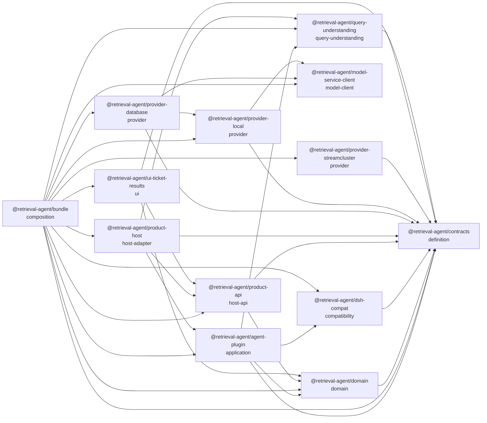

<!-- Generated from package.json by scripts/workspace-contracts.mjs. -->
# Workspace 能力图

本图来自实际 workspace 的 package.json；角色说明来自 architecture/workspace.json。箭头表示已声明的构建依赖（包含开发/peer 依赖），不是运行时数据流或依赖许可清单。

| 包 | 角色 | 职责 | 已声明的一方依赖 |
| --- | --- | --- | --- |
| `@retrieval-agent/agent-plugin` | application | DSH 工具、上下文与领域控制器编排，MySQL 权威任务、租约和事件提交、Session 镜像恢复；不拥有 Provider 算法。 | `@retrieval-agent/contracts` `@retrieval-agent/domain` `@retrieval-agent/dsh-compat` `@retrieval-agent/query-understanding` |
| `@retrieval-agent/bundle` | composition | 固定产品 preset、Cordis patch、默认 Provider 与发布闭包装配；不含业务策略。 | `@retrieval-agent/agent-plugin` `@retrieval-agent/contracts` `@retrieval-agent/domain` `@retrieval-agent/dsh-compat` `@retrieval-agent/model-service-client` `@retrieval-agent/product-api` `@retrieval-agent/product-host` `@retrieval-agent/provider-database` `@retrieval-agent/provider-local` `@retrieval-agent/provider-streamcluster` `@retrieval-agent/query-understanding` `@retrieval-agent/ui-ticket-results` |
| `@retrieval-agent/contracts` | definition | 跨进程与跨层共享的领域类型、事件和 Provider 端口；不含实现策略。 | — |
| `@retrieval-agent/domain` | domain | 领域状态、条件与证据约束，以及共享的结果投影和重放；result/replay 子路径不依赖 Node 或 DSH。 | `@retrieval-agent/contracts` |
| `@retrieval-agent/dsh-compat` | compatibility | 固定 DSH 0.1.5-rc.2 的事件注册、历史 Session 迁移与 OpenCode 会话请求头接线、版本握手和退出断言。 | `@retrieval-agent/contracts` |
| `@retrieval-agent/model-service-client` | model-client | 同一 Python 模型服务的版本化 HTTP 客户端；主入口提供 embedding/rerank，ranking 子入口提供排名、授权候选校验及可取消的索引准备长任务。 | — |
| `@retrieval-agent/product-api` | host-api | 可信 Host 的当前授权呈现、详情读取、版本化确认结果分页导出和审计；共享状态投影与浏览器下载客户端。 | `@retrieval-agent/contracts` `@retrieval-agent/domain` |
| `@retrieval-agent/product-host` | host-adapter | 把 Product API 与独立任务工作台绑定到 DSH，装配持久 worker、查询分析器和可信主体，处理命令、快照、SSE 与确认导出。 | `@retrieval-agent/agent-plugin` `@retrieval-agent/contracts` `@retrieval-agent/product-api` `@retrieval-agent/query-understanding` |
| `@retrieval-agent/provider-database` | provider | 版本化 MySQL 字面全集与 Milvus 向量召回、索引发布和增量搜索结果。 | `@retrieval-agent/contracts` `@retrieval-agent/model-service-client` `@retrieval-agent/provider-local` |
| `@retrieval-agent/provider-local` | provider | 开发期只读 Provider、授权快照、来源适配、字段级证据读取与 RAG 排名装配；raw 仅作为受限本地来源存储。 | `@retrieval-agent/contracts` `@retrieval-agent/model-service-client` |
| `@retrieval-agent/provider-streamcluster` | provider | 版本化 StreamCluster 只读 HTTP 契约、远端授权传递、超时取消与结构化错误映射。 | `@retrieval-agent/contracts` |
| `@retrieval-agent/query-understanding` | query-understanding | 校验 FastAPI/spaCy 分析，按用户原文编译明确条件、数量及歧义，装配首轮 Hybrid 请求；不拥有检索算法。 | `@retrieval-agent/contracts` |
| `@retrieval-agent/ui-ticket-results` | ui | DSH 候选与确认结果面板、会话头下载入口；复用 Product API 客户端。 | `@retrieval-agent/contracts` `@retrieval-agent/domain` `@retrieval-agent/product-api` |

浏览器通过 domain/result、domain/replay 和 product-api 的明确客户端出口复用逻辑；Host、数据库和 DSH 装配保留在服务端。测试按用户行为或实际失败边界组织，不要求与实现文件一一对应。发布检查只处理 bundle 实际运行依赖闭包。
